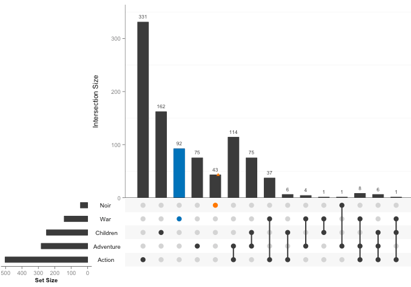

```{r setup, fig.height=4, fig.width=8, echo = F, message = F}
library(tidyverse)
library(cowplot)
knitr::opts_chunk$set(fig.path = './', echo = F, message = F)
```

[](http://beta.mybinder.org/v2/gh/raynamharris/vennbar/master?urlpath=rstudio)
Click the button to launch a Binder R session and tinker with all the bar plots or explore the code in the cloud. Navigate to the `examples` directory where there is a subdirectory for each of the four examples, all identified by the first or last author.

```{r vennbar, fig.height=4, fig.width=7, include=F}
p1 <- ggdraw() + draw_image("examples/toth2017/toth-original-alt-1.png")
p2 <- ggdraw() + draw_image("examples/pena2019/pena-original-alt-1.png")
p3 <- ggdraw() + draw_image("examples/geffre2017/geffre-original-alt-1.png")
p4 <- ggdraw() + draw_image("examples/calisi2017/calisi-original-alt-1.png")

plot_grid(p1,p3,p4,p2, labels = c(1,2,3,4), label_size = 8)
```

```{r vennbar2, fig.height=4, fig.width=7, include=T}
p1a <- ggdraw() + draw_image("examples/toth2017/GOvenn-original.png")
p1b <- ggdraw() + draw_image("examples/toth2017/GOvenn-alt-1.png") 
p2a <- ggdraw() + draw_image("examples/pena2019/fig2venn-original.png")
p2b <- ggdraw() + draw_image("examples/pena2019/fig2venn-alt2-3.png") 
p3a <- ggdraw() + draw_image("examples/geffre2017/venn-original.png")
p3b <- ggdraw() + draw_image("examples/geffre2017/venn-alt-1.png")
p4a <- ggdraw() + draw_image("examples/calisi2017/venn-original.png")
p4b <- ggdraw() + draw_image("examples/calisi2017/venn-alt-1.png")

plot_grid(p1a,p3a,p4a,p2a,
          p1b,p3b,p4b,p2b,
          nrow = 2,
          labels = c(1,2,3,4,
                     NULL,NULL,NULL,NULL), label_size = 8)
```


[Venn diagrams](https://en.wikipedia.org/wiki/Venn_diagram) are a type of figure that I see a lot of behavioral genomics research. While Venn diagrams are a great way to _conceptualize_ the goal of looking for shared or unique transcriptional responses to experimental manipulations, I don't think they are the best way to _vizualize empirical data_. 

I searched for "Venn" in Garrett Grolemund & Hadley Wickham's [R for Data Science](https://r4ds.had.co.nz/) book and in Claus Wilke's [Fundamentals of Data Visualization](https://serialmentor.com/dataviz/) book, for guidance alternatives to the Venn diagram. Neither book discusses Venn diagrams, but they both provide valuable insight into creating bar plots. Interestingly, the R for Data Science book does use Venn diagrams to illustrate the differences between `inner_join` and `full_join`, so that provides some evidence that Venn diagrams are useful for conceptualizing ideas about data.)

The [UpSet plot](https://www.ncbi.nlm.nih.gov/pmc/articles/PMC4720993/) has gained some popularity since 2016. I've made a handful of UpSet plots with [`upsetR`](https://github.com/hms-dbmi/UpSetR). While it is possible to modify the aesthetics of an UpSet plot, it is very challenging to manipulate the size, shape, colors, and font to the degree that is needed to combine many plots into one multi-panel figure for a manuscript. 



I do really like the bar charts in the UpSet plot, so I set out to recreate them with [`ggplot2`](https://ggplot2.tidyverse.org/) and [`cowplot`](https://cran.r-project.org/web/packages/cowplot/vignettes/introduction.html). You can explore all the code in my [vennbar repository on GitHub](https://github.com/raynamharris/vennbar). 

With this blog post, my goal is to encourage more scientists to use **bar charts instead of Venn diagrams** to communicate experimental results. Here, I compare four Venn diagrams from published research articles to four bar plots that I made with `tidyverse` and `cowplot`. I think these bar plots can be made more simplicity, flexibility, reliability, and reproducibility than a Venn diagram. These Venn diagrams all come from labs that I admire and respect. I really value their research contributions, but I do hope to see more alternatives for Venn diagrams in future publications.


**Example 1**  is from [Cognitive specialization for learning faces is associated with shifts in the brain transcriptome of a social wasp by Berens _et al_. 2017](http://jeb.biologists.org/content/220/12/2149). In this example, the circles do not represent a meaningful quantity. A stacked bar plot can use color, space, and text to highlight patterns in the data, which in this case appears to be a greater overlap than expected. I wanted to make the bar plot mirror the Venn diagram as closely as possible, but I changed the order of the factors so that "both" category was plotted first. This was necessary for adding text to the bar chart because the values for _P. metricus_ and both were overlapping when I kept the "both" category in the middle. [Here is the code](https://github.com/raynamharris/vennbar/blob/master/examples/toth2017/toth-venn.md) for my bar plot alternative.


**Example 2** is from [Transcriptomics of an extended phenotype: parasite manipulation of wasp social behaviour shifts expression of caste-related genes by Geffre et al.](https://royalsocietypublishing.org/doi/full/10.1098/rspb.2017.0029?url_ver=Z39.88-2003&rfr_id=ori:rid:crossref.org&rfr_dat=cr_pub%3dpubmed). As with example 1, the size of these circles does convey any meaning about the size of the sets. The bar chart really highlights that fact that that "worker versus gyne" (or "WorkGyne" for short) comparison yields the most differentially expressed genes. However, that was not the main message of the Venn diagram. The authors used an arrow an `*` to highlight one particular comparison, so I used a bright red fill to highlight the parasite manipulation candidate genes. [Here is the code](https://github.com/raynamharris/vennbar/blob/master/examples/geffre2017/geffre-venn.md) for my bar plot alternative. 


**Example 3** is from [Sex-biased transcriptomic response of the reproductive axis to stress by Calisi et al. 2017](https://www.sciencedirect.com/science/article/pii/S0018506X17302696?via%3Dihub). This weighted Venn diagram is the highest quality Venn diagram I've ever seen, but it still has limitations. If you only focus on the green pies, they seem to do a good job of conveying relative size, but if you look closely, you'll notices that the size of the grey circles is misleading. The original Venn diagram conveys information about tissue (hypothalamus, pituitary, gonad), sex (male and female), and response (up- or down-regulation), so I used facetting and a combination of stacked and side-by-side bar plot to visualize all the complexity. I think that this bar chart does a better job of conveying the magnitude of differences between the sexes and across tissues and the bias toward up-regulation of gene expression. [Here is the code](https://github.com/raynamharris/vennbar/blob/master/examples/calisi2017/calisi-venn.md) for my bar plot alternative, as well as a less-squished version of the bar plot.  


**Example 4** is from [Early life stress alters transcriptomic patterning across reward circuitry in male and female mice by Peña _et al._ 2017](https://www.biorxiv.org/content/10.1101/624353v1). Here, the Venn diagrams are also scales, but each of the six subplots has their own scaling, so you cannot compare all six visually. Moreover, the authors report the *percent* of shared gene expression in the manuscript, but their Venn diagrams show *counts*. So, I calculated the percent of shared differentially expressed genes (%DEGs) and colored all overlapping responses in shades of purple and the unique responses in shades of orange. Now, once can spot interesting trends in the data, like increase response to early and late life stress (ELS + STVS) in the female PFC. This is something that is present but not emphasized in the Venn. [Here is the code](https://github.com/raynamharris/vennbar/blob/master/examples/pena2019/pena-venn.md) for my bar plot alternative.


So, that's my comparison of four Venn diagrams and four possible bar plot alternatives. What do you think? Do you see the advantages? What other alternatives do you suggest? Comments welcome!