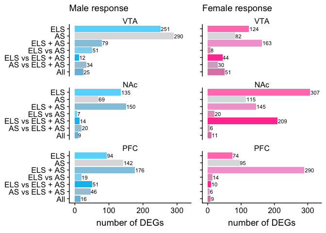
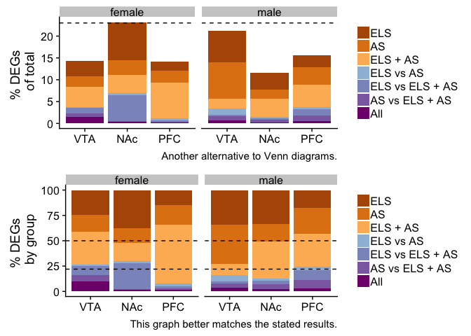

Click the button to launch a Binder R session.

Some data vizualization for the preprint [Early life stress alters transcriptomic patterning across reward circuitry in male and female mice](https://www.biorxiv.org/content/10.1101/624353v1) by Catherine Jensen Peña _et al._

Original Venn diagrams from the manuscript (Figure 2a, f, i, q, v). 

Bar chart style version of the same data. (Here AS stands for "adult stress" which encompaseses "Defeat" and "STVS".)

To explore this analysis in the cloud, click the Binder button above and navigate to the [fig1venn.Rmd](./fig2venn.Rmd) file. Or, to go straight to the results, navigate to [fig1venn.md](./fig2venn.md).