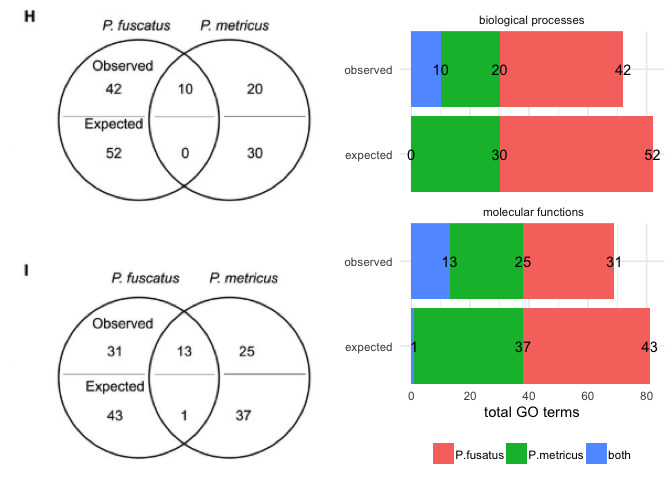
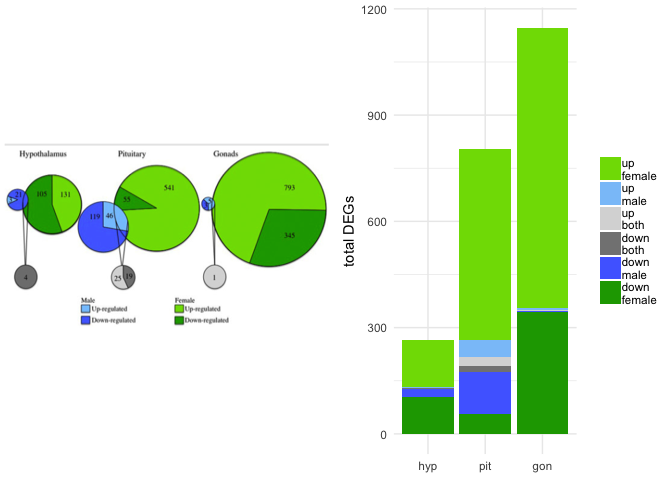
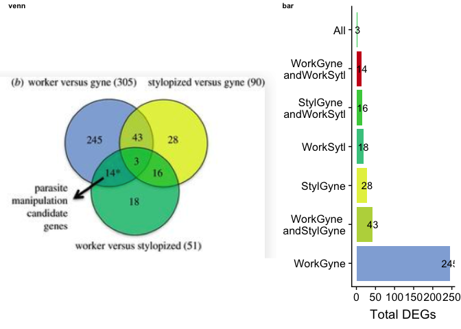
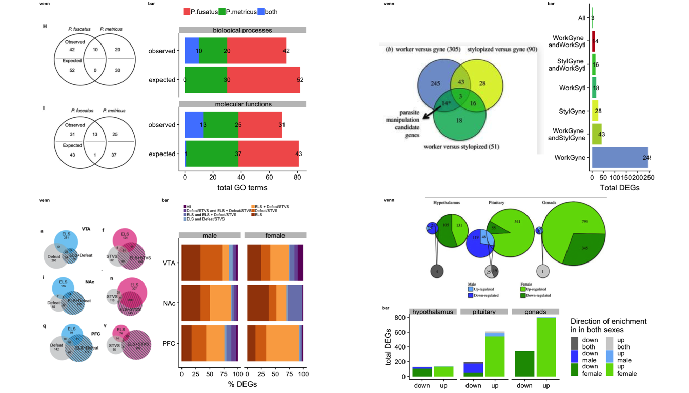

Click the button to launch a Binder R session and tinker with all the
bar plots or explore the code in the cloud.

I would like to see more scientists using bar charts instead of Venn
diagrams. I’d like to illustrate why that is by showing some comparisons
published venn diagrams to bar plots made with `tidyverse` and
`cowplot`. I want to point out that the research in the papers is sound.
There aren’t many excellent alternatives to Venn diagrams, so that’s why
I want to champion the bar plot for its simplicity and reproducibility.
Let me know what you think and what other alternatives you might have.

Example 1 is from [Cognitive specialization for learning faces is
associated with shifts in the brain transcriptome of a social wasp by
Berens et al.](http://jeb.biologists.org/content/220/12/2149). The code
for my bar plot alternative [is here](./examples/toth2017/GOvenn.md). in
this example, the circles do not represent a meaningful quantity. A
stacked bar plot can use color, space, and text to highlight patterns in
the data. A table is another possible and easily reproducible
alternative.

Example 2 if from [Sex-biased transcriptomic response of the
reproductive axis to stress by Calisi et
al.](https://www.sciencedirect.com/science/article/pii/S0018506X17302696?via%3Dihub).
The code for my bar plot alternative [is
here](./examples/calisi2017/venn.md). This weighted Venn diagram is the
highest quality Venn diagram I’ve ever seen. Here, the circles convey
meaning at large sizes, but they lose resolution at smaller values. I
think bar plots can convey the data more accurately. This faceted and
stacked bar plot really highlights the magnitude of the sex difference
between males and females.

Example 3 if from [Transcriptomics of an extended phenotype: parasite
manipulation of wasp social behaviour shifts expression of caste-related
genes by Geffre et
al.](https://royalsocietypublishing.org/doi/full/10.1098/rspb.2017.0029?url_ver=Z39.88-2003&rfr_id=ori:rid:crossref.org&rfr_dat=cr_pub%3dpubmed).
The code for my bar plot alternative [is
here](./examples/geffre2017/venn.md). Again, these circles do not
represent the data. This is a simple bar chart without any fancy
facetting or stacking. I flipped the coordinates rather than rotating
the text. The authors used an arrow, but I used a bright red fill to
highly the candidate genes.

Example 4 from [Early life stress alters transcriptomic patterning
across reward circuitry in male and female
mice](https://www.biorxiv.org/content/10.1101/624353v1) by Catherine
Jensen Peña *et al.* The code for my bar plot alternative [is
here](./examples/pena2019/fig2venn.md). This might be my favorite. The
subplot has its own scaling, so of circles cannot be compared across
plots. Moreover, the authors report the per cent of shared gene
expression, which venn diagrams shos counts. So, I calculated the per
cent. Shared gene expression patterns are shown in purple; unique gene
expression in orange. Now, you can spot unusual trends in the data, like
increase response to early and late life stress in the female PFC. This
is something that is hidden in the Venn Diagram.

