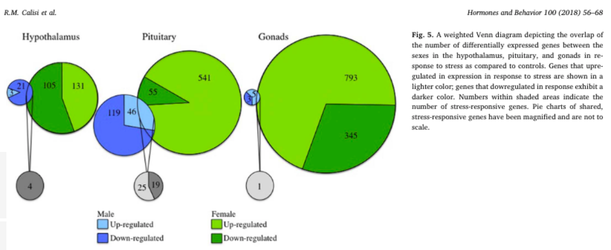

# Sex-biased transcriptomic response of the reproductive axis to stress

This venn diagram is from [this paper](https://www.sciencedirect.com/science/article/pii/S0018506X17302696?via%3Dihub)



```{r setup, message = F, echo = T}
library(ggplot2)
library(dplyr)
library(cowplot)
#library(ggrepel)

knitr::opts_chunk$set(fig.path = './', echo = T, message = F)
```

```{r venn-alt}
venn <- read.csv("venn.csv")

venn$tissue <- factor(venn$tissue, levels = c("hyp", "pit", "gon"))
venn$sex <- factor(venn$sex, levels = c("female", "both", "male"))
levels(venn$direction) <-  c("down", "up")
#levels(venn$tissue) <-  c("hypothalamus", "pituitary", "gonads")


venn$directionsex <- as.factor(paste(venn$direction, venn$sex, sep = "\n"))


mycolors <- c("down\nboth" = "#838383",
                "down\nfemale" = "#19A400", 
                 "down\nmale"  = "#516DFF",
                 "up\nboth"  = "#D9D9D9",
                 "up\nfemale"  = "#7EDC00",
                 "up\nmale" = "#8AC5F9")  


venn$directionsex <- factor(venn$directionsex, levels = c("down\nfemale", 
                                                          "down\nmale",
                                                          "down\nboth",
                                                          "up\nboth",
                                                          "up\nmale",
                                                            "up\nfemale"))

p2 <- ggplot(data=venn, aes(x=tissue, y = count,  fill = reorder(directionsex, desc(directionsex)))) + 
  geom_bar(stat="identity") +
  labs(y = "total DEGs", x = NULL) +
  scale_fill_manual(values = mycolors) +
  theme_minimal() +
    theme(legend.title = element_blank())
p2 
```


```{r calisi-original-alt}
p1 <- ggdraw() + draw_image("venn-original.png")
plot_grid(p1, p2, nrow = 1, rel_widths = c(0.5, 0.5))
```

This weighted Venn diagram is the highest quality Venn diagram I’ve ever
seen, but it still has limitations. If you only focus on the green pies,
they seem to do a good job of conveying relative size, but if you look
closely, you’ll notices that the size of the grey circles is misleading.
The original Venn diagram conveys information about tissue
(hypothalamus, pituitary, gonad), sex (male and female), and response
(up- or down-regulation), so I used facetting and a combination of
stacked and side-by-side bar plot to visualize all the complexity. I
think that this bar chart does a better job of conveying the magnitude
of differences between the sexes and across tissues and the bias toward
up-regulation of gene expression. 