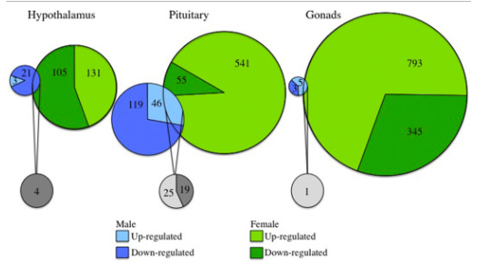

# Sex-biased transcriptomic response of the reproductive axis to stress

This venn diagram is from [this paper](https://www.sciencedirect.com/science/article/pii/S0018506X17302696?via%3Dihub)



```{r setup, message = F, echo = F}
library(ggplot2)
library(dplyr)
library(cowplot)
#library(ggrepel)

knitr::opts_chunk$set(fig.path = './', echo = F, message = F)
```

```{r venn-alt}
venn <- read.csv("venn.csv")

venn$tissue <- factor(venn$tissue, levels = c("hyp", "pit", "gon"))
venn$sex <- factor(venn$sex, levels = c("female", "both", "male"))

venn$directionsex <- as.factor(paste(venn$direction, venn$sex, sep = "\n"))
venn$directionsex <- factor(venn$directionsex, levels = c("down-reg\nfemale",
                                                          "up-reg\nfemale", 
                                                          "down-reg\nmale",
                                                          "up-reg\nmale", 
                                                          "down-reg\nboth", 
                                                          "up-reg\nboth"))

mycolors <- c("down-reg\nboth" = "#838383",
                "down-reg\nfemale" = "#19A400", 
                 "down-reg\nmale"  = "#516DFF",
                 "up-reg\nboth"  = "#D9D9D9",
                 "up-reg\nfemale"  = "#7EDC00",
                 "up-reg\nmale" = "#8AC5F9")   


p2 <- ggplot(data=venn, aes(x=direction, y = count,  fill = reorder(directionsex, desc(directionsex)))) + 
  geom_bar(stat="identity") +
  labs(y = "total DEGs", x = NULL) +
  scale_fill_manual(values = mycolors) +
  theme(legend.title = element_blank()) +
  #geom_text_repel(position = "stack", aes(x=direction, y = count,  label = count ))
  facet_wrap(~tissue) 
p2
```


```{r calisi-venn-original-alt}
p1 <- ggdraw() + draw_image("venn-original.png")
plot_grid(p1, p2, nrow = 2, rel_heights =  c(.55, 0.45),
          labels = c("venn", "bar"), label_size = 8)
```

