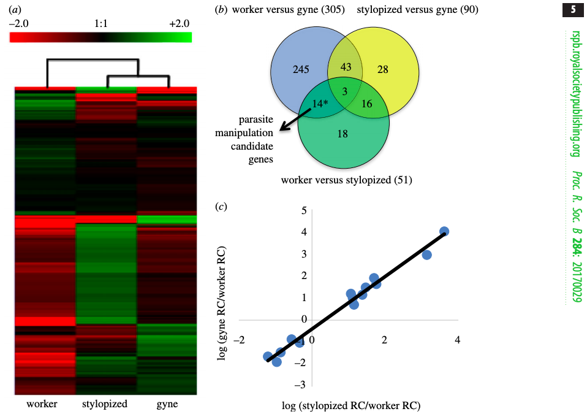
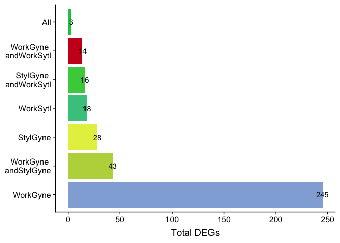

Transcriptomics of an extended phenotype: parasite manipulation of wasp social behaviour shifts expression of caste-related genes
=================================================================================================================================

This venn diagram is from [this
paper](https://royalsocietypublishing.org/doi/full/10.1098/rspb.2017.0029?url_ver=Z39.88-2003&rfr_id=ori:rid:crossref.org&rfr_dat=cr_pub%3dpubmed)

    library(ggplot2)
    library(dplyr)
    library(cowplot)

    knitr::opts_chunk$set(fig.path = './', message = F)

    venn <- read.csv("venn.csv")

    mycolors <- c("All" = "#0FC74C",
                 "WorkSytl" = "#43C78E",
                  "WorkGyne and WorkSytl" = "#cb181d", 
                   "WorkGyne" = "#91AEDA", 
                 "WorkGyne and StylGyne" = "#BAD54A" ,
                 "StylGyne" = "#E5EF4E",
                  "StylGyne and WorkSytl" = "#46CD4A"
                  )   

    p2 <- ggplot(data=venn, aes(x=reorder(comparison, desc(count)), y = count,  fill = comparison)) + 
      geom_bar(stat="identity") +
      labs(y = "Total DEGs", x = NULL) +
      scale_fill_manual(values = mycolors) +
      theme_minimal() +
      theme(legend.title = element_blank(),
            legend.position = "none") +
      scale_x_discrete(labels=c("All" = "All",
                 "WorkSytl" = "WorkSytl",
                  "WorkGyne and WorkSytl" = "WorkGyne \nandWorkSytl", 
                   "WorkGyne" = "WorkGyne", 
                 "WorkGyne and StylGyne" = "WorkGyne \nandStylGyne" ,
                 "StylGyne" = "StylGyne",
                  "StylGyne and WorkSytl" = "StylGyne \nandWorkSytl")) +
      geom_text(aes(x=reorder(comparison, desc(count)),  label = count, hjust = 0.5)) +
      coord_flip()
    p2

    p1 <- ggdraw() + draw_image("venn-original.png")
    plot_grid(p1, p2, rel_widths = c(0.6,0.4))

As with example 1, the size of these circles does convey any meaning
about the size of the sets. The bar chart really highlights that fact
that that “worker versus gyne” (or “WorkGyne” for short) comparison
yields the most differentially expressed genes. However, that was not
the main message of the Venn diagram. The authors used an arrow an `*`
to highlight one particular comparison, so I used a bright red fill to
highlight the parasite manipulation candidate genes.
