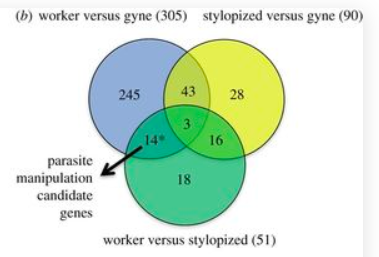

  
# Transcriptomics of an extended phenotype: parasite manipulation of wasp social behaviour shifts expression of caste-related genes
  
  This venn diagram is from [this paper](https://royalsocietypublishing.org/doi/full/10.1098/rspb.2017.0029?url_ver=Z39.88-2003&rfr_id=ori:rid:crossref.org&rfr_dat=cr_pub%3dpubmed)



```{r setup, message = F, echo = F}
library(ggplot2)
library(dplyr)
library(cowplot)

knitr::opts_chunk$set(fig.path = './', echo = F, message = F)
```


```{r venn-alt}
venn <- read.csv("venn.csv")

mycolors <- c("All" = "#0FC74C",
             "WorkSytl" = "#43C78E",
              "WorkGyne and WorkSytl" = "#cb181d", 
               "WorkGyne" = "#91AEDA", 
             "WorkGyne and StylGyne" = "#BAD54A" ,
             "StylGyne" = "#E5EF4E",
              "StylGyne and WorkSytl" = "#46CD4A"
              )   

p2 <- ggplot(data=venn, aes(x=reorder(comparison, desc(count)), y = count,  fill = comparison)) + 
  geom_bar(stat="identity") +
  labs(y = "Total DEGs", x = NULL) +
  scale_fill_manual(values = mycolors) +
  theme(legend.title = element_blank(),
        legend.position = "none") +
  scale_x_discrete(labels=c("All" = "All",
             "WorkSytl" = "WorkSytl",
              "WorkGyne and WorkSytl" = "WorkGyne \nandWorkSytl", 
               "WorkGyne" = "WorkGyne", 
             "WorkGyne and StylGyne" = "WorkGyne \nandStylGyne" ,
             "StylGyne" = "StylGyne",
              "StylGyne and WorkSytl" = "StylGyne \nandWorkSytl")) +
  geom_text(aes(x=reorder(comparison, desc(count)),  label = count, hjust = 0.5)) +
  coord_flip()
p2
```

```{r geffre-original-alt}
p1 <- ggdraw() + draw_image("venn-original.png")
plot_grid(p1, p2, rel_widths = c(0.6,0.4),
          labels = c("venn", "bar"), label_size = 8)
```