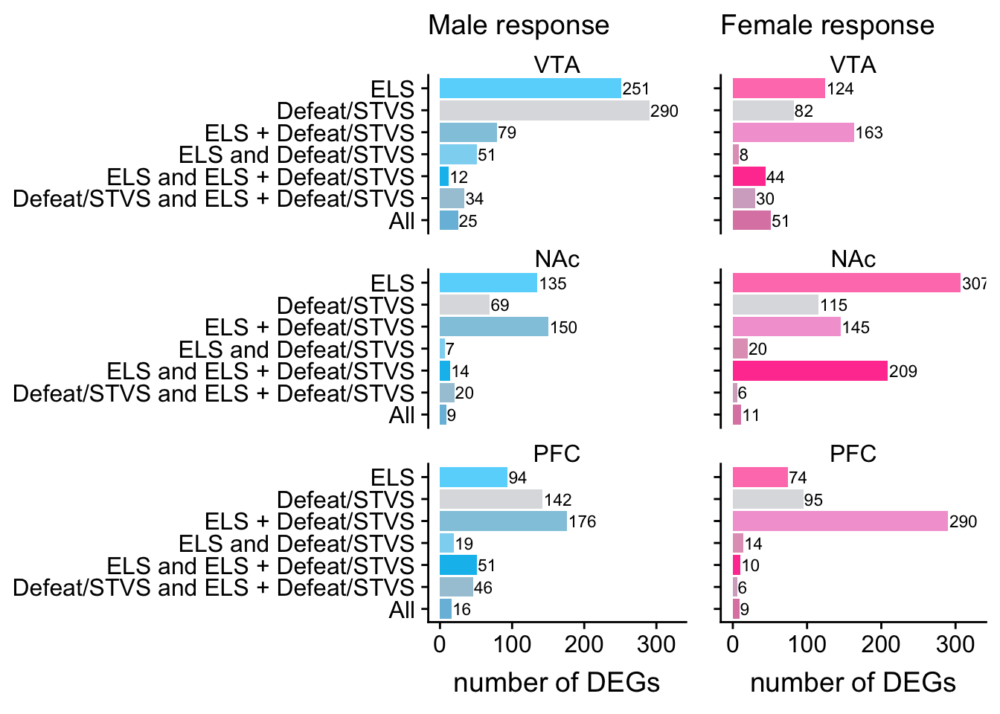
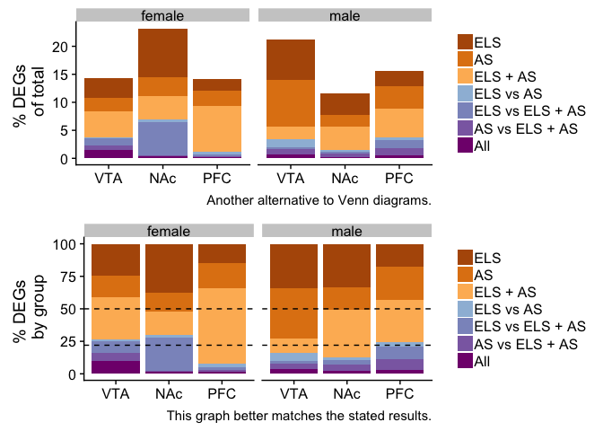
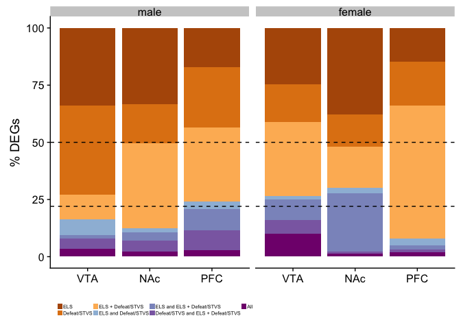
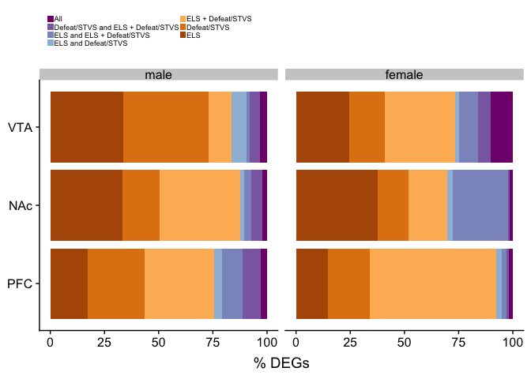
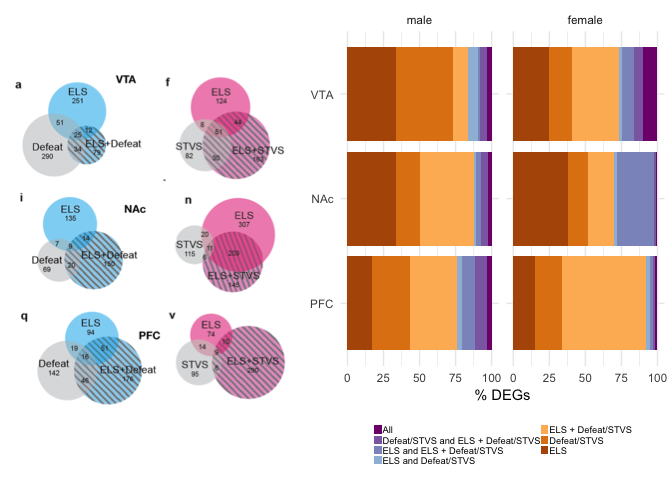

Early life stress alters transcriptomic patterning across reward circuitry in male and female mice
==================================================================================================

This venn diagram is from [this
paper](https://www.biorxiv.org/content/10.1101/624353v1)

