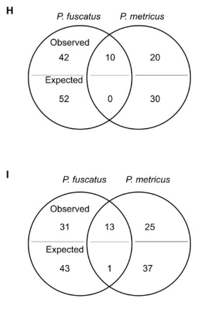

# Cognitive specialization for learning faces is associated with shifts in the brain transcriptome of a social wasp

This venn diagram is from [this paper](http://jeb.biologists.org/content/220/12/2149)



```{r setup, message = F, echo = F}
library(ggplot2)
library(cowplot)

knitr::opts_chunk$set(fig.path = './', echo = F, message = F)
```

```{r GOvenn-alt}
GOvenn <- read.csv(file = "./GOvenn.csv")
#head(GOvenn)

GOvenn$species <- factor(GOvenn$species, levels = c("P.fusatus", "P.metricus",  "both"))

p <- ggplot(data=GOvenn, aes(x=pattern, y = count,  fill = species)) + 
  geom_bar(stat="identity")  + 
  coord_flip() +
  facet_wrap(~GO, nrow = 2) +
  geom_text(position = "stack", aes(x=pattern, y = count,  label = count, hjust = 0.5)) +
  theme(legend.position = "top",
        legend.title = element_blank()) +
  labs(x = NULL)
p

```

```{r GOvenn-original-alt}
p2 <- ggdraw() + draw_image("GOvenn-original.png", scale = 0.9)
plot_grid(p2, p, rel_widths = c(0.4,0.6))
```