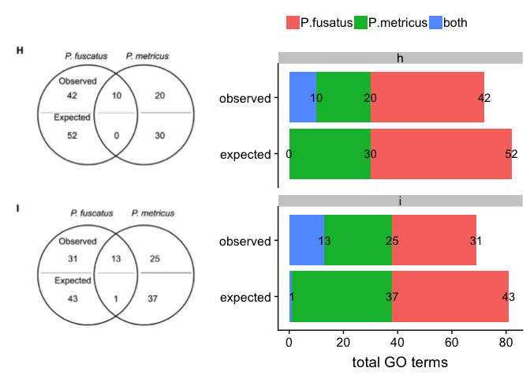

Cognitive specialization for learning faces is associated with shifts in the brain transcriptome of a social wasp
=================================================================================================================

This venn diagram is from [this
paper](http://jeb.biologists.org/content/220/12/2149)

