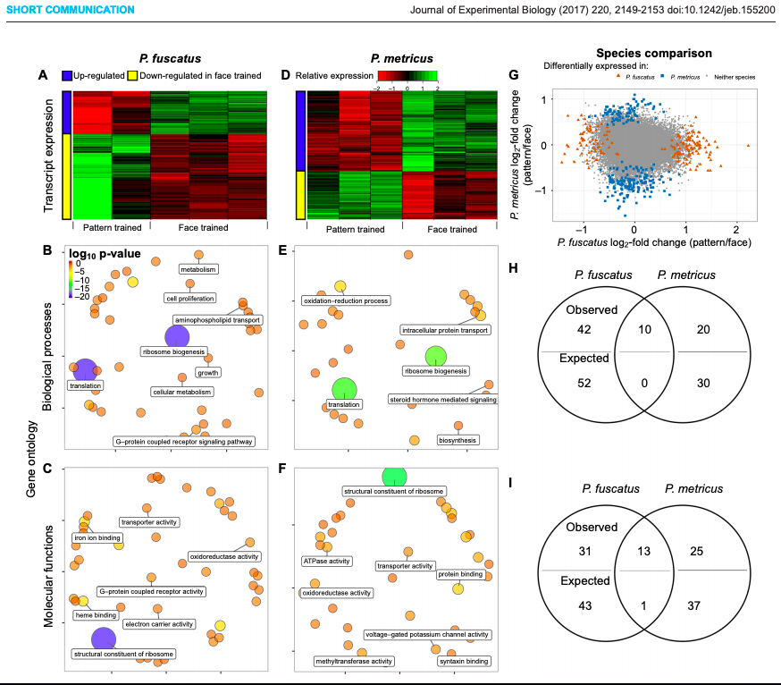
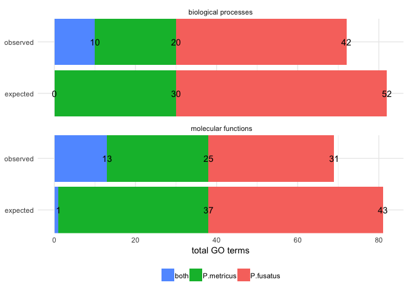

Cognitive specialization for learning faces is associated with shifts in the brain transcriptome of a social wasp
=================================================================================================================

This venn diagram is from [this
paper](http://jeb.biologists.org/content/220/12/2149)

    library(tidyverse)
    library(cowplot)

    knitr::opts_chunk$set(fig.path = './', echo = T, message = F)

    GOvenn <- read.csv(file = "./GOvenn.csv")
    #head(GOvenn)

    GOvenn$species <- factor(GOvenn$species, levels = c("P.fusatus", "P.metricus",  "both"))

    levels(GOvenn$GO) <- c("biological processes", " molecular functions")

    GOvenn %>%
      spread(species, count) %>%
      select(GO, pattern,P.fusatus, both, P.metricus)

    ##                     GO  pattern P.fusatus both P.metricus
    ## 1 biological processes expected        52    0         30
    ## 2 biological processes observed        42   10         20
    ## 3  molecular functions expected        43    1         37
    ## 4  molecular functions observed        31   13         25

    p <- ggplot(data=GOvenn, aes(x=pattern, y = count,  fill = species)) + 
      geom_bar(stat="identity")  + 
      theme_minimal() +
      scale_x_discrete(name = NULL,
                       expand = c(0,0)) +
      coord_flip() +
      facet_wrap(~GO, nrow = 2) +
      geom_text(position = "stack", aes(x=pattern, y = count,  label = count, hjust = 0.5)) +
      theme(legend.position = "bottom",
            legend.title = element_blank()) +
      labs(x = NULL, y = "total GO terms") +
      guides(fill = guide_legend(reverse = TRUE))
    p

    p2 <- ggdraw() + draw_image("GOvenn-original.png")
    plot_grid(p2, p, rel_widths = c(0.5,0.5))

In this example, the circles do not represent a meaningful quantity. A
stacked bar plot can use color, space, and text to highlight patterns in
the data, which in this case appears to be a greater overlap than
expected. I wanted to make the bar plot mirror the Venn diagram as
closely as possible, but I changed the order of the factors so that
“both” category was plotted first. This was necessary for adding text to
the bar chart because the values for *P. metricus* and both were
overlapping when I kept the “both” category in the middle.
