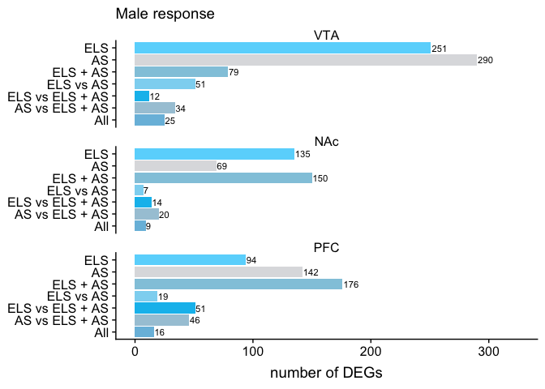
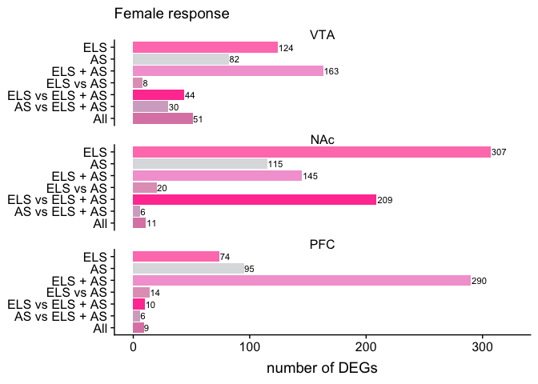

    library(ggplot2)
    library(dplyr)
    library(cowplot)

    knitr::opts_chunk$set(fig.path = './')

    fig1venn <- read.csv("fig1venn.csv")

    head(fig1venn)

    ##   panel    sex region group number
    ## 1     a   male    VTA   ELS    251
    ## 2     f female    VTA   ELS    124
    ## 3     i   male    NAc   ELS    135
    ## 4     n female    NAc   ELS    307
    ## 5     q   male    PFC   ELS     94
    ## 6     v female    PFC   ELS     74

    summary(fig1venn)

    ##  panel     sex     region               group       number     
    ##  a:7   female:21   NAc:14   All            :6   Min.   :  6.0  
    ##  f:7   male  :21   PFC:14   AS             :6   1st Qu.: 14.5  
    ##  i:7               VTA:14   AS vs ELS + AS :6   Median : 51.0  
    ##  n:7                        ELS            :6   Mean   : 83.4  
    ##  q:7                        ELS + AS       :6   3rd Qu.:132.2  
    ##  v:7                        ELS vs AS      :6   Max.   :307.0  
    ##                             ELS vs ELS + AS:6

    fig1venn$region <- factor(fig1venn$region, levels = c("VTA", "NAc", "PFC")) 
    fig1venn$group <- factor(fig1venn$group, levels = c("All" ,  
                                                           "AS vs ELS + AS",
                                                           "ELS vs ELS + AS" ,
                                                           "ELS vs AS",
                                                           "ELS + AS",
                                                           "AS",
                                                           "ELS" 
                                                           ))

    males <- fig1venn %>% filter(sex == "male") %>% droplevels()
    females <- fig1venn %>% filter(sex == "female") %>% droplevels()

    m <- ggplot(data=males, aes(x=group, y = number,  fill = group)) + 
      geom_bar(stat="identity")  + 
      coord_flip() + 
      facet_wrap(~region, nrow = 3) +
      scale_x_discrete(drop=FALSE)+
      scale_y_continuous(limits=c(0, 325)) +
      scale_fill_manual(values = c("All" = "#79BDDE",  
                                    "AS vs ELS + AS" = "#A7C8D9",
                                    "ELS vs ELS + AS" = "#03BEEE" ,
                                    "ELS vs AS" = "#8DD6F2",
                                    "ELS + AS" = "#92C9DE",
                                    "AS" = "#DDDEE0",
                                    "ELS" = "#69D7FC" )) +
      geom_text(aes(label=number),size=3, hjust = -0.05) +
      guides(fill = guide_legend(reverse = TRUE)) +
      theme(legend.title = element_blank(),
            legend.position = "none",
            strip.background = element_rect( fill="white")) +
      labs(subtitle = "Male response",
           x = NULL, y = "number of DEGs") 
    m

    f <- ggplot(data=females, aes(x=group, y = number,  fill = group)) + 
      geom_bar(stat="identity")  + 
      coord_flip() + 
      facet_wrap(~region, nrow = 3) +
      scale_x_discrete(drop=FALSE)+
      scale_y_continuous(limits=c(0, 325)) +
      scale_fill_manual(values = c("All" = "#DE87B3",  
                                    "AS vs ELS + AS" = "#D4AEC9",
                                    "ELS vs ELS + AS" = "#FF469F" ,
                                    "ELS vs AS" = "#E2A1BF",
                                    "ELS + AS" = "#F3A4D5",
                                    "AS" = "#DDDEE0",
                                    "ELS" = "#FF80BB" )) +
      geom_text(aes(label=number),size=3, hjust = -0.05) +
      guides(fill = guide_legend(reverse = TRUE)) +
      theme(legend.title = element_blank(),
            legend.position = "none",
            strip.background = element_rect( fill="white")) +
      labs(subtitle = "Female response",
           x = NULL, y = "number of DEGs") 
    f

    plot_grid(m, f + theme(axis.text.y=element_blank()), 
              nrow = 1, rel_widths = c(0.6,0.4))

